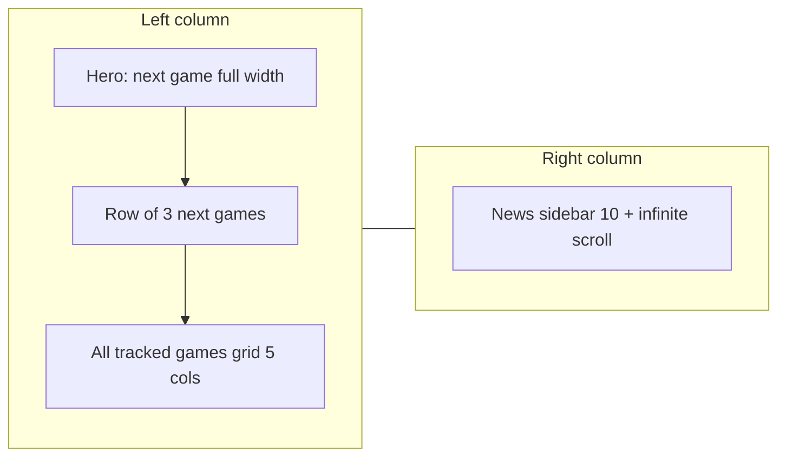

# User Dashboard Layout Improvements

> **For Claude:** Use executing-plans to implement this plan task-by-task when executing.

**Goal:** Improve the user dashboard so that (1) the **next game** is a full-width hero with a bigger countdown and cover blended into the background, (2) the **three following games** appear under it, (3) **news** is in a right sidebar with 10 items and infinite scroll, and (4) **all tracked games** stay below with a 5-per-line grid.

**Architecture:** Two-column layout on large screens: left column = hero (1st upcoming) + row of 3 (2nd–4th upcoming) + "All tracked games" grid (5 columns); right column = "Latest news" (News model, tracked games only) with initial 10 items and infinite scroll. On smaller screens, stack: hero, then 3 next, then news (or reflow), then tracked games. Reuse existing `getUpNextProperty()` but split: first item = hero, next 3 = row. New or refactored Livewire component for news sidebar (news-only, paginated via infinite scroll).

**Tech stack:** Laravel 12, Livewire 4, Flux, Tailwind v4, existing countdown script or Alpine. No new dependencies.

**Key files:**
- [resources/views/dashboard.blade.php](resources/views/dashboard.blade.php) – layout wrapper (two-column on lg)
- [resources/views/components/⚡dashboard-game-list.blade.php](resources/views/components/⚡dashboard-game-list.blade.php) – hero, "3 next", tracked games grid; remove or relocate current feed inclusion
- New: hero block (full-width card, blended cover, large countdown)
- New or refactor: Livewire news sidebar component (news-only, 10 + infinite scroll)
- [app/Services/DashboardFeedService.php](app/Services/DashboardFeedService.php) – optional: add a news-only method for the sidebar, or query News directly in the new component

---

## Layout (target)

- **Hero:** Single "next" game (first of `upNext`). Full width of left column. Cover image as background (blurred or gradient-blended), large countdown (e.g. days/hours/minutes, prominent typography), title overlay. Link to game page.
- **3 next:** Same data as current "Up next" but skip first; show items 2–4 in a horizontal row (reuse [resources/views/components/game-card.blade.php](resources/views/components/game-card.blade.php)).
- **News sidebar:** Only `News` for user's tracked games, ordered by `published_at` desc. Initial load 10; infinite scroll (e.g. `wire:scroll` or Alpine + Livewire) to load next page (e.g. 10 per page). Each item: title, game name, date, link to article. Right column fixed width on lg (e.g. `w-80` or `min-w-[18rem]`).
- **Tracked games:** Unchanged behavior (sort/filter); only change grid from `sm:grid-cols-2 lg:grid-cols-3` to 5 columns on large (e.g. `lg:grid-cols-5`), keep responsive for smaller (e.g. 1 col mobile, 2–3 tablet).

---

## Task 1: Dashboard two-column layout and hero

**Files:** [resources/views/dashboard.blade.php](resources/views/dashboard.blade.php), [resources/views/components/⚡dashboard-game-list.blade.php](resources/views/components/⚡dashboard-game-list.blade.php).

- In `dashboard.blade.php`: Wrap content in a two-column grid on `lg`: e.g. `lg:grid lg:grid-cols-[1fr_18rem] lg:gap-8`. Left: `livewire:dashboard-game-list`. Right: new Livewire news sidebar (Task 2).
- In `dashboard-game-list`: Split "Up next" into:
  - **Hero:** If `$this->upNext->isNotEmpty()`, render first game as a full-width hero card: cover as background (e.g. `background-image` with overlay so the image blends into the background; use `bg-zinc-900/80` or similar overlay for legibility). Large countdown (e.g. `text-3xl` or `text-4xl` font-mono, accent color). Title and optional "Until release" label. Reuse existing countdown `data-countdown` / `data-release-iso` / `data-countdown-display` script so it stays in sync.
  - **3 next:** If `$this->upNext->count() >= 2`, render items 2–4 in a grid: `grid gap-6 lg:grid-cols-3`. Use existing `<x-game-card>` for each.
- Ensure hero is a single full-width block in the left column; no extra wrapper that limits width. Use `rounded-xl` and overflow-hidden for the blended background image.

---

## Task 2: News sidebar component (10 items, infinite scroll)

**Files:** New Livewire component (e.g. `resources/views/components/⚡dashboard-news-sidebar.blade.php`), optionally a dedicated method in `DashboardFeedService` or inline query.

- **Data:** For authenticated user, query `News::query()->whereIn('game_id', $user->trackedGames()->pluck('games.id'))->with('game')->orderByDesc('published_at')`. Paginate (e.g. 10 per page); expose `items` and `hasMore`.
- **Component state:** `$page = 1`, `$perPage = 10`. Load first page on mount; method `loadMore()` increments `$page` and appends next 10.
- **Infinite scroll:** Use Livewire's `wire:scroll` (e.g. "load more when user scrolls to bottom" of the sidebar container) or Alpine + `$wire.loadMore()` on intersection. Ensure only news items are shown (no GameActivity); reuse existing News model and `game` relation.
- **View:** Section heading "Latest news" or "News". List of items: news title (link to `url`), game name (link to game show), published date. Compact list style; dark mode supported.
- Register the component and embed in dashboard right column.

---

## Task 3: Tracked games grid to 5 columns

**Files:** [resources/views/components/⚡dashboard-game-list.blade.php](resources/views/components/⚡dashboard-game-list.blade.php).

- Change the "All tracked games" grid from `grid gap-6 sm:grid-cols-2 lg:grid-cols-3` to `grid gap-6 sm:grid-cols-2 md:grid-cols-3 lg:grid-cols-4 xl:grid-cols-5` (or `lg:grid-cols-5` if 5 per line is desired from lg up). Use gap utilities; no margin hacks.

---

## Task 4: Relocate or remove "Recent updates" feed

**Files:** [resources/views/components/⚡dashboard-game-list.blade.php](resources/views/components/⚡dashboard-game-list.blade.php), [resources/views/components/⚡dashboard-feed.blade.php](resources/views/components/⚡dashboard-feed.blade.php).

- Current layout has "Recent updates" (mixed news + GameActivity) between "Up next" and "All tracked games". New layout: hero + 3 next + tracked games on the left; news-only on the right.
- **Option A:** Remove `<livewire:dashboard-feed />` from the dashboard so the only "news" surface is the new sidebar. Mixed feed (news + release activities) could be dropped from this page or linked elsewhere (e.g. "All updates" link).
- **Option B:** Keep the mixed feed below the tracked games grid (single column) so users still see release date changes etc.
- **Recommendation:** Remove the feed from between up-next and grid; add the news-only sidebar. If product wants the mixed feed, add a small "Recent updates" block below the grid or in the sidebar as a second section in a follow-up.

---

## Task 5: Responsive behavior

- **Mobile / narrow:** Stack: hero (full width), then row of 3 (e.g. 1 col or 2–3 cols), then news sidebar (full width), then tracked games grid (1–2 cols). Prefer simple stack: hero → 3 next → news list → grid.
- **Large:** Left column (hero + 3 next + grid), right column (news), e.g. `lg:grid lg:grid-cols-[1fr_18rem]`. Sidebar can be `lg:sticky lg:top-24` so news stays visible while scrolling left column (optional).

---

## Task 6: Tests and polish

- **Tests:** Update [tests/Feature/DashboardTest.php](tests/Feature/DashboardTest.php): authenticated user sees hero when they have at least one upcoming tracked game; sees 3 next when they have at least 2–4; sees news sidebar with news for tracked games only; sees tracked games grid (5 columns on large viewport if asserting class or count). Add or adjust test for news sidebar: initial 10 items, loadMore adds more.
- **Pint:** Run `vendor/bin/pint --dirty` on touched PHP.
- **Accessibility:** Hero and news links keyboard-focusable; sidebar has `aria-label`; countdown has `role="timer"` and `aria-live="polite"` (already in game-card); avoid removing focus management when adding infinite scroll.

---

## Summary

| Step | Action |
|------|--------|
| 1 | Two-column dashboard layout; hero (first upNext) full-width with blended cover and large countdown; 3 next games in a row below |
| 2 | New news sidebar Livewire component: 10 news items, infinite scroll, right column |
| 3 | Tracked games grid: 5 columns per line on xl (or lg) |
| 4 | Remove or relocate current "Recent updates" mixed feed |
| 5 | Responsive: stack on small screens |
| 6 | Tests and Pint |

---

## Notes

- **Hero image:** "Blended into background" can be achieved with the cover as a full-bleed background, gradient overlay so it fades into the page background (e.g. `bg-gradient-to-b from-transparent to-zinc-950` over the image), and rounded corners so it feels like one card.
- **Countdown:** Reuse the same script block that runs `querySelectorAll('[data-countdown]')` so the hero countdown and the 3 next cards' countdowns all update; ensure the hero's countdown element has larger typography (e.g. `text-3xl` / `text-4xl`).
- **News vs mixed feed:** This plan prioritizes "news on the right" as a news-only list. The existing DashboardFeedService and dashboard-feed component remain usable for a "Recent updates" (mixed) experience elsewhere or below the grid if desired.
